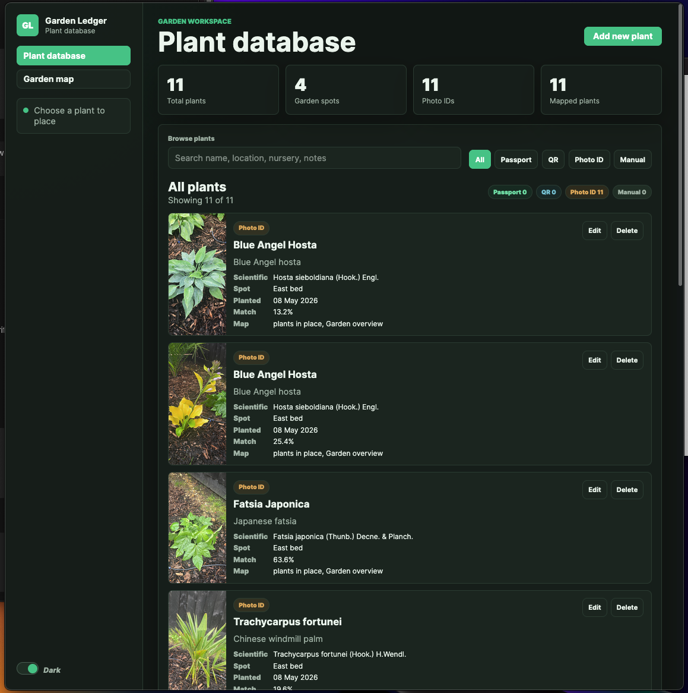
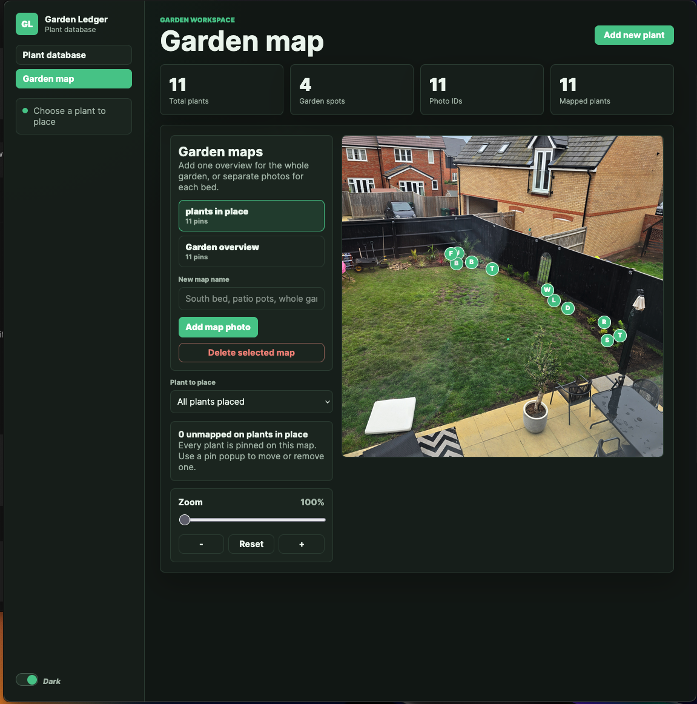

# Garden Ledger

I've never been a gardener, so as I approach my 56th birthday I figured it was
about time I tried it out. Our new-build garden is very bare, just grass
basically, so I dug out a border and went to town.

But I wanted a way of recording what I'd planted, with a side-quest of being
able to add care instructions in the future. So I've made a Docker container if
anyone wants to give it a spin.

You can add a plant by uploading a photo, which gets identified using an API
call to [PlantNet](https://my.plantnet.org/), which offers a free account.

You can also upload multiple photos of your garden and place pins where the
plants are.





A self-hosted garden inventory for recording plants from:

- plant passport or nursery label text
- QR label images through the browser `BarcodeDetector` API
- plant photos identified through the PlantNet API
- one or more garden photos used as placement maps for recorded plants

The app runs as a single Vue 3/Vite front end with a small Node/SQLite API in
one Docker container. It stores plant metadata in SQLite and uploaded photos on
disk under the mounted `/data` volume.

## Deploy From GitHub

On the Linux host:

```bash
git clone https://github.com/b8z-io/garden-ledger.git
cd garden-ledger
cp .env.example .env
```

Edit `.env` and set:

```bash
PLANTNET_API_KEY=your-token-here
APP_PORT=3033
```

Then start it:

```bash
docker compose up -d --build
```

For updates:

```bash
git pull
docker compose up -d --build
```

## Docker Compose

Copy `.env.example` to `.env` if you want a fresh config, then add your PlantNet
token:

```bash
PLANTNET_API_KEY=your-token-here
```

Start it:

```bash
docker compose up -d --build
```

By default the compose file maps `APP_PORT` to container port `3000`:

```bash
APP_PORT=3000
```

If Traefik will route directly to the service, you can remove the `ports` block
and attach the service to your proxy network/labels later. The container itself
listens on `3000`.

## Persistence

The named volume `garden-ledger-data` is mounted at `/data`.

Inside the container:

- SQLite database: `/data/garden-ledger.sqlite`
- Uploaded photos: `/data/uploads`

For local development outside Docker, `.env.example` uses `./data` instead.

## Local Development

```bash
npm install
npm run dev
npm run build
```

## Notes

QR scanning depends on browser support for `BarcodeDetector`. When
`PLANTNET_API_KEY` is missing, photo uploads still save locally, but
identification returns a setup status instead of species candidates.
